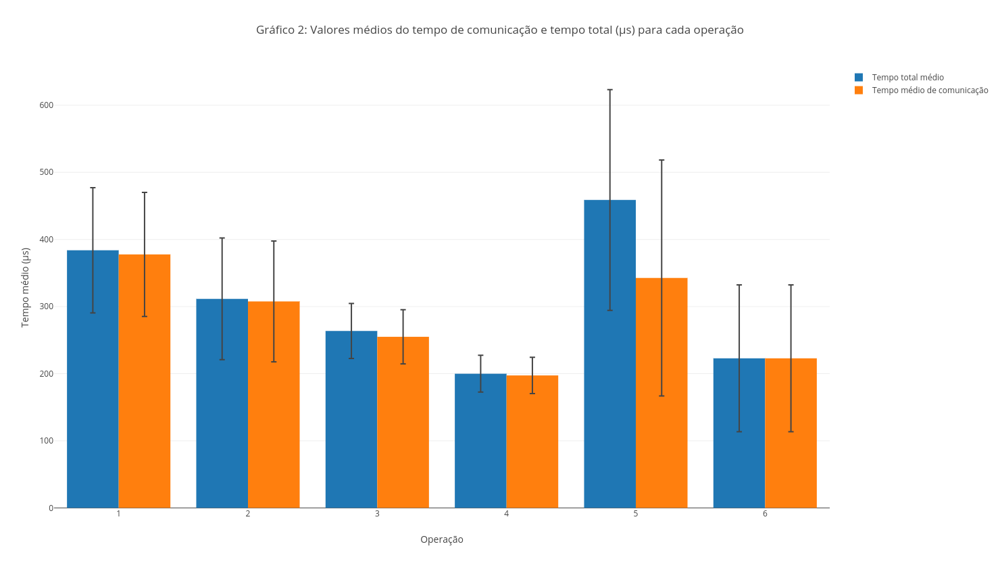

# MC833 1S2018 Unicamp - Projeto 3
### [Giovani Nascimento Pereira](github.com/giovaninppc) - 168609
### [Ignacio Ribeiro Espinoso](github.com/ignacioespinoso) - 169767

# [Projeto 3](https://github.com/ignacioespinoso/mc833/proj3)

# I - Introdução

O projeto 3 consiste em implementar uma conexão RMI entre cliente e servidor. O RMI é uma interface de programação que permite a execução de chamadas remotas no estilo RPC (chamar um processo remotamente) em aplicações desenvolvidas em Java[4]. 

No caso, a aplicação do servidor consiste em um sistema que armazena dados relativos a disciplinas (códigos, ementas e comentários) para consulta e alterações por parte do cliente. Vale notar que existem dois tipos de usuário: aluno e professor, de forma que somente um professor pode executar determinadas operações. As seguintes operações podem ser realizadas por qualquer tipo de usuário:

- Obter todas as disciplinas
- Obter descrição de uma disciplina específica.
- Obter informação completa de uma disciplina específica.
- Obter informação da próxima aula de uma disciplina específica.
- Obter todas as informações de todas as disciplinas.
- Fechar conexão.

Operações restritas a professores:

- Definir comentário da próxima aula.
- Enviar mensagem.

> As mensagens, formatos e base de dados são as mesmas dois dois projetos anteriores. Isso para permitir a comparação entre os desempenhos de todos os métodos de conexão.

# II - Sistema / Metodologia

A execução pode ser separada em atividades do Servidor e do Cliente.

O **Servidor** é composto pelos arquivos:

- Server.java: O código base do servidor que cria o server e trata a conexão;
- Compute.java: Interface com os métodos que podem ser chamados pelo cliente;
- ConnectionTime.java: Classe que auxilia na tomada de tempo das execuções;
- Mais os arquivos da base de dados.

Já o **Cliente** é composto pelos arquivos:

- Client.java: O código base do cliente, que trata conexão e envio de mensagens;
- ConnectionTime.java: Classe que auxilia na tomada de tempo das execuções.

Para a **Base de dados** os arquivos são:

- College.java: Mock da base de dados que é passada para o cliente.
- Discipline.java: efinição da classe que guarda as informações das disciplinas.

### Executando Localmente

Para executar o programa, primeiro deve-se iniciar o servidor.

Para compilar os arquivos:
Da pasta raiz do projeto, vá para o diretório src e lá abra o terminal.  Assim, execute do terminal o comando ```javac proj3/*.java```. Esse comando já vai compilar todos os arquivos, e gerar os executáveis (.class) na mesma pasta.

Depois, iniciamos o objeto remoto ```rmiregistry &```, e para rodar o servidor usamos o comando ```java -classpath /<filepath**>/ proj3.Server &```. Isso vai deixar o servidor rodando em background.

Então agora falta inicializar o **Cliente**, para isso basta executar o comando ```java -classpath /<filepath>/ Client```, isso já vai executar o Cliente no seu terminal e o usuário terá acesso às requisições disponíveis.

> \* O comando rmiresgistry cria e começa o registro de um objeto remoto na porta especificado no host corrente. Se a porta for omitida, ele é iniciado por *default* na porta 1099. O comando não produz outputs, e tipicamente roda em background ```rmiregistry &```.
> 
> \*\* O *\<filepath\>* é o caminho até a pasta onde estão os arquivos. Ele pode ser obtido através do comando ```pwd```.

### Executando em duas máquinas

Para executar em duas máquinas, elas devem estar ambas conectadas à internet. Uma será o servidor, e a outra fará o papel do cliente.

No **servidor**, compile os arquivos novamente (apenas para garantir a existência dos executáveis), inicie o objeto remoto com o comando ```rmiregistry &``` e agora execute o servidor com o comando 

```
java -classpath /<filepath>/ proj3.Server -Djava.rmi.server.hostname=x
```
Onde **x** representa o IP do próprio servidor.

Agora no cliente, compile os arquivos novamente e execute o cliente com o seguinte comando:

```
java -classpath /<filepath>/ proj3.Client x
```
Onde x é novamente o IP do seu servidor.

Se der tudo certo, isso vai fazer com que o cliente se conecte ao servidor no IP especificado e comece a conexão.

### Executando em TEST MODE (Modo de teste)
O TEST MODE, foi o modo de execução criado para simular todas as iterações necessárias para calcular os tempos médios de conexão do programa. Ele executa 50 vezes cada request especificado pelo projeto.

Para realizar teste local, rode em um terminal normalmente os comandos de compilação os arquivos .java do projeto e o comando de execução do servidor. Em outro execute terminal o cliente em modo de teste com através do uso do argumento TEST, ```java -classpath /<filepath>/ proj3.Client TEST```, isso fará automaticamente todas as iterações de envio e recebimento de mensagem.

Para realizar teste remoto, execute o servidor em uma máquina com make run_server, e em outra compile o cliente com make client e execute com ./client xxx.xx.xx TEST, o último identificador avisa o programa para entrar em modo de teste.

Vale notar que para enviar o output a um arquivo de log se adicionou um ```>clientLog.txt``` ao final do comando de execução do cliente e ```>serverLog.txt``` ao final do comando de execução do servidor.

# III - Estrutura

### Armazenamento de Dados no Servidor

O arquivo **College.java** é o que sintetiza toda a *base de dados* do nosso servidor. Uma instancia dessa classe é carregada junto com o servidor assim que instanciado, dessa forma, todos os dados são carregador na memória junto com o server\*\*\*.

Para cada disciplina é instanciado um objeto do tipo **Discipline**:

```java
public class Discipline {
    public String codigo;
    public String nome;
    public String ementa;
    public String professor;
    public String sala;
    public String comentario;
    
    //(construtor...)
}
```

E as disciplinas são inciadas no Sevirdor no método ```CreateUnicamp()```, que cria o modelo de disciplinas utilizados num vetor que armazena todas as disciplinas.

Esta foi a mesma abordagem utilizada nos outros dois projetos, pois permite alcançar os resultados esperados apesar de ser uma implementação relativamente simples, ela também é executada mais rapidamente que requisições a bancos de dados, ou leituras em arquivos.

Um dos problemas que ela acarreta, por outro lado, é o aumento do tamanho do código do servidor, pois toda a base de dados faz parte desse conjunto de instruções, então não é uma abordagem viável para um sistema real - ou que contenha um volume maior de dados.

> \*\*\* Não há persistência de dados nesse modelo.

# IV - Implementação

### Formato

A comunicação entre cliente e servidor se deu através de uma conexão TCP, assim todo o processo de handshake foi implementado. Para cada novo cliente, o servidor dá um fork, de forma que que as requisições são processadas e respondidas de acordo com o cliente de origem.

### Mensagens / Requests

As requests que o cliente pode mandar para o servidor foram categorizadas para facilitar a identificação (conforme dados na especificação do laboratório):

| Categoria | Request                                 | Mensagem**                |
|-----------|-----------------------------------------|---------------------------|
| 1         | Pegar todas as disciplinas e códigos    | "1 Get all subjects"      |
| 2         | Pegar ementa de uma disciplina          | "2 XXXX***"               |
| 3         | Pegar toda informação de uma disciplina | "3 XXXX"                  |
| 4         | Pegar comentário da próxima aula        | "4 XXXX"                  |
| 5         | Pegar toda a informação disponível      | "5 Get all subjects info" |
| 6         | Configurar comentário da próxima aula   | "6 XXXX txt"              |

> \*\* Mensagem enviada para o servidor
>
> \*\*\* XXXX é um substituto para o código da disciplina que será requisitada
> 
 
Note que a primeira informação de cada mensagem é um número, referente ao identificador (categoria) da operação. Essa é a informação que é inicialmente analisada pelo servidor, para identificar qual o tipo de requisição o usuário está fazendo, e depois, o restante da mensagem de acordo com a operação.

Como a troca de mensagens é feita inteiramente por Strings, esse método foi escolhido por formar uma maneira simples de identificar as mensagens (decodificar a requisição), e definir quais repostas deveriam partir do servidor em cada caso.

### Usuário Aluno Professor

O usuário do tipo **Aluno** é o usuário padrão, ele tem acesso livre às requisições dos tipos 1 a 5. Caso tente fazer uma requisição do tipo 6, o servidor irá retornar uma mensagem de erro, pois este usuário não possui esta permissão.

Apenas o usuário **Professor** tem acesso à requisição 6 - *Configurar comentário da próxima aula*. Para tanto, o usuário deve autenticar-se como professor, isso é feito pelo comando *secreto* 9, que manda uma mensagem para o servidor e autentica o usuário como professor. Assim, se ele mandar alguma requisição do tipo 6, ela será devidamente processada.

### Saídas

Toda mensagem enviada e recebida - pelo cliente e servidor, é mostrada na saída padrão, bem como o tempo de cada execução.

No cliente, o tempo refere-se ao intervalo entre enviar uma requisição e receber uma resposta. No servidor, o tempo refere-se ao intervalo de processamento, entre a chegada da mensagem, e o momento de envio. Para se encontrar o tempo de conexão, ou seja, apenas o tempo gasto entre a comunicação dos dois sockets, deve-se subtrair, para uma mesma conexão, o tempo de conexão do servidor do tempo de conexão do cliente.

## Casos de Uso
### Aluno

Com o Servidor já em execução um aluno pode se conectar executando o código do cliente
```java -classpath /<filepath>/ Client xxx.xxx.xxx```
sabendo o IP **x** do servidor. Uma vez conectado, o cliente irá exibir a lista de requests que podem ser feitas ao servidor.

Vamos supor que o aluno queira saber o que acontecerá na próxima aula de uma determinada disciplina, ou seja, uma requisição do tipo **4**, ele irá digitar o código da operação e em seguida a disciplina da qual ele procura a informação: ```4 EE532```.

O programa do cliente então envia a mensagem para o servidor, e espera por uma resposta. Dada uma resposta correta, o cliente deve receber algo do tipo:

```
Entrega de terça-feira disponível no Drive da turma.
```

Ele então decide encerrar o programa, com o comando 0, e isso encerra a execução.


# V - Resultados

### Teste local

Executando o programa localmente, em TEST MODE, pegamos informações sobre o tempo de comunicação entre os processos distintos cliente e servidor.

O tempo médio de comunicação para cada Operação (conforme descrito na seção II - Mensagens) e o desvio padrão pode ser observado na tabela abaixo:

| Categoria | Media (μs) | Desvio Padrão (μs) | Intervalo de Confiança |
|-----------|------------|--------------------|------------------------|
| 1         |        |                |                     |
| 2         |        |                |                     |
| 3         |        |                |                     |
| 4         |        |                |                     |
| 5         |        |                |                     |
| 6         |        |                |                     |

TODO:::::ANALISAR



### Test com máquinas separadas

TODO

# VI - Conclusão

TODO

# VII - Referências

[1] Implementing a Remote Interface. Disponível em: https://docs.oracle.com/javase/tutorial/rmi/implementing.html

[2] Getting Started Using Java™ RMI. Disponível em: https://docs.oracle.com/javase/7/docs/technotes/guides/rmi/hello/hello-world.html

[3] Frequently Asked Questions: Java™ RMI and Object Serialization. Disponível em: https://docs.oracle.com/javase/7/docs/technotes/guides/rmi/faq.html

[4] RMI. DIsponível em: http://www.oracle.com/technetwork/java/javase/tech/index-jsp-136424.html

[5] rmiregistry - The Java Remote Object Registry. Disponível em: https://docs.oracle.com/javase/7/docs/technotes/tools/solaris/rmiregistry.html
